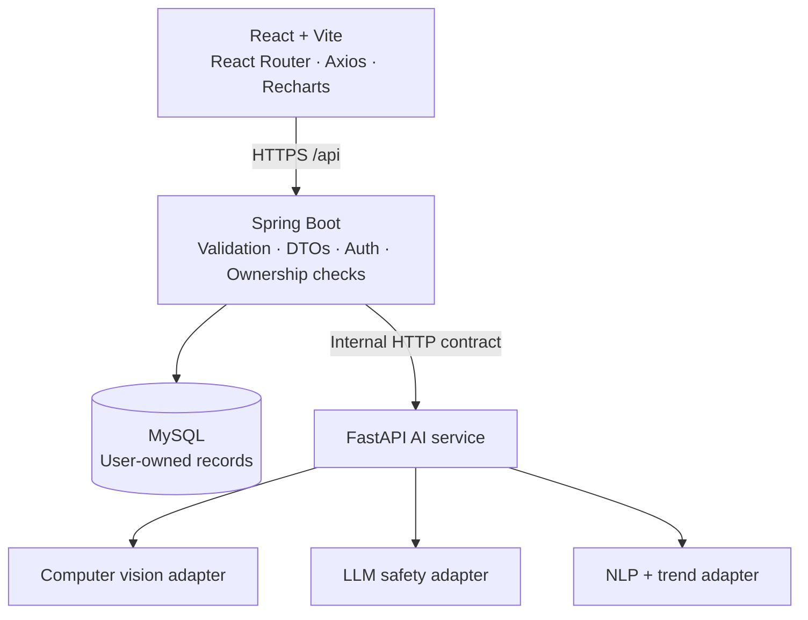

# AI Health Companion

> Your intelligent companion for everyday food, health and wellness.

AI Health Companion is a full-stack, safety-first health and wellness platform for a BTech project or hackathon. It will combine visible fruit/vegetable condition guidance, a general-information health chat, and personal mood/wellness trends in one private dashboard.

> **Medical and wellness boundary:** This application provides general informational guidance only. It does not diagnose diseases, prescribe treatment, replace clinicians or provide emergency care. For severe or emergency symptoms, seek appropriate care immediately.

## Current implementation status

**End-to-end demo implementation is complete.** The repository contains an independently runnable React client, Spring Boot API, MySQL Docker configuration, JWT/BCrypt authentication, ownership-scoped persistence, food scanning, health chat, wellness trends, a FastAPI AI-service boundary, and explicit mock mode. Production provider adapters and advanced integrations remain documented extension points.

## Problem statement

Everyday health choices are fragmented: someone may wonder whether produce looks usable, need plain-language context about a symptom, or want to spot a connection between sleep and stress. Existing tools often make medical claims that go beyond what an image, journal entry or conversational model can safely establish.

## Proposed solution

One responsive workspace will let an authenticated user:

- assess *visible* fruit/vegetable condition with explicit food-safety limits;
- ask a safety-aware AI for general health information and red-flag next steps;
- record mood, stress, energy, sleep and an optional journal entry;
- review personal charts and non-diagnostic trend observations; and
- keep scans, conversations and wellness data private to their own account.

## Features

| Area | Planned capability | Key safety boundary |
| --- | --- | --- |
| 🍎 Food Freshness Scanner | Image preview, food identification, visible freshness score, observations, recommendation and history | No image can guarantee safety or identify bacteria, toxins or internal spoilage. |
| 💬 Smart Health Chat | Conversation history, follow-up questions, general self-care context and red-flag escalation | No diagnosis, treatment plan or unsafe medication instruction. |
| 🧠 Mental Wellness & Mood Trend Monitor | Daily ratings, journal, charts and weekly comparisons | Trends/language are not depression, anxiety or other mental-health diagnoses. |
| 📊 Personal dashboard | User-owned summaries, quick actions and recent activity | Requires JWT authentication and ownership checks. |

## A. Complete architecture

The design separates the browser, secure application API, database and AI-provider adapters. The Spring Boot application is the system of record and policy enforcement point; FastAPI hosts replaceable AI integrations.



See [architecture details](docs/architecture.md) for component responsibilities, request flows and the provider-replacement boundary.

## B. Folder structure

```text
AI-Health-Companion/
├── frontend/                         # React/Vite JavaScript client
│   ├── src/
│   │   ├── components/               # Reusable UI components
│   │   ├── pages/                    # Router-level pages
│   │   ├── services/                 # Axios client and feature APIs
│   │   ├── hooks/ context/ utils/ assets/
│   │   └── App.jsx, main.jsx, styles.css
│   └── package.json
├── backend/                          # Spring Boot application
│   └── src/main/java/com/healthcompanion/
│       ├── ai/ config/ controller/ dto/ entity/
│       ├── exception/ repository/ security/ service/
│       └── AiHealthCompanionApplication.java
├── ai-service/                       # Optional FastAPI provider boundary
│   ├── food_detection/ chatbot/ wellness/ models/
│   ├── services/                     # Provider-neutral contracts
│   └── main.py
├── docs/                             # Architecture, database and API documentation
├── compose.yaml                      # Local MySQL service
└── .env.example                      # Safe configuration template
```

## C. Database ER diagram description

`User` is the ownership root. It has one-to-many relationships with `FoodScan`, `ChatConversation`, `WellnessEntry` and `WellnessAnalysis`; `ChatConversation` has one-to-many `ChatMessage` records. Every child-resource query is filtered by the JWT-authenticated user ID.

The planned field-level schema, indexes, foreign keys and Mermaid ER diagram are in [database design](docs/database-design.md).

## D. API specification

The currently available endpoint is:

```http
GET /api/status
```

It verifies the React-to-Spring connection and visibly reports `AI_MODE`. The planned auth, user, food, chat and wellness REST endpoints—with ownership, HTTP-status and validation conventions—are in the [API specification](docs/api-specification.md).

## E. AI architecture

Each feature is behind a provider-neutral contract:

```text
Controller → Feature service → AI client → FoodAnalysisService / HealthChatService / WellnessAnalysisService
```

- **Mock mode:** `AI_MODE=mock` is the default. It is explicit in the UI. Future sample responses will be deterministic and labelled development/mock, never represented as genuine inference.
- **Production mode:** `AI_MODE=production` routes food scans through `AI_PROVIDER_BASE_URL` (default `http://localhost:8000`) to the Python `/analyze/food/base64` contract. Provider failures return a safe unavailable response rather than invented AI output. The bundled provider deliberately returns `Unable to Determine` until a trained computer-vision model is configured.
- **Safety controls:** the food feature speaks only about visible characteristics; chat uses a non-diagnostic safety policy and emergency escalation; wellness analysis describes self-reported patterns, not disorders.

## F. Development roadmap

| Phase | Scope | State |
| --- | --- | --- |
| 1 | Repository setup, React/Spring connection, MySQL and AI boundary | ✅ Complete |
| 2 | Registration, login, BCrypt, JWT, protected routes and `User` entity | ✅ Complete |
| 3 | Authenticated dashboard, navigation and profile shell | ✅ Complete |
| 4 | Secure image upload, food scanner, mock/production CV boundary and scan history | ✅ Complete (mock provider) |
| 5 | Chat conversations/messages and safety-aware mock assistant | ✅ Complete (mock provider) |
| 6 | Wellness check-ins, trend calculations, charts-ready data and observations | ✅ Complete |
| 7 | Authorization, upload limits, validation and global errors | ✅ Complete |
| 8 | Responsive/accessibility polish, loading/empty/error states | ✅ Complete |
| 9 | Backend MVC and frontend lint/build verification | ✅ Complete; feature test expansion remains future work |
| 10 | Deployment documentation, screenshots and provider deployment | Extension work |

## G. Setup requirements

| Requirement | Recommended version | Local status |
| --- | --- | --- |
| JDK | 21 or newer | JDK 24 detected |
| Maven | 3.9 or newer | Install required (not currently on PATH) |
| Node.js | 20 or newer | Node 24 detected |
| npm | bundled with Node | npm 11 detected |
| Docker Desktop | Current version with Compose v2 | Required for the provided MySQL quick start |
| Python | 3.11 or newer | Needed only when starting `ai-service` |

## Installation and running

1. Create local configuration from the safe template. Do not commit the resulting `.env`.

   ```powershell
   Copy-Item .env.example .env
   ```

2. Change the two placeholder MySQL passwords in `.env`, then start MySQL.

   ```powershell
   docker compose --env-file .env up -d mysql
   ```

3. Start Spring Boot in another terminal. Maven downloads dependencies on the first run.

   ```powershell
   cd backend
   mvn spring-boot:run
   ```

   Confirm `http://localhost:8080/api/status` returns an `available` JSON response.

4. Start the React client in another terminal.

   ```powershell
   cd frontend
   npm install
   npm run dev
   ```

   Open `http://localhost:5173`. Its landing-page connection badge should show **Secure API connected · mock AI mode**.

5. The FastAPI service is scaffolded but not required during Phase 1. To verify its readiness boundary:

   ```powershell
   cd ai-service
   python -m venv .venv
   .\.venv\Scripts\Activate.ps1
   pip install -r requirements.txt
   uvicorn main:app --reload --port 8001
   ```

   Then open `http://localhost:8001/health`.

## Environment variables

| Variable | Purpose | Required now |
| --- | --- | --- |
| `DB_URL`, `DB_USERNAME`, `DB_PASSWORD` | Spring Boot MySQL connection | Yes, unless using defaults that match Compose |
| `MYSQL_DATABASE`, `MYSQL_USER`, `MYSQL_PASSWORD`, `MYSQL_ROOT_PASSWORD`, `MYSQL_HOST_PORT` | MySQL Compose container setup (`3307` avoids conflicts with a local MySQL service) | Yes for Compose |
| `CORS_ALLOWED_ORIGINS` | Comma-separated trusted frontend origins | Default is local Vite |
| `AI_MODE` | `mock` or `production`; visible and never silent | Defaults to `mock` |
| `AI_PROVIDER_BASE_URL`, `AI_PROVIDER_API_KEY` | Reserved production provider configuration | No, future production mode |
| `JWT_SECRET` | Reserved for Phase 2 JWT signing | No, required before auth is enabled |
| `VITE_API_BASE_URL` | Client API origin, if not using Vite’s local proxy | No |

## Testing

The backend includes an MVC test for the public status endpoint:

```powershell
cd backend
mvn test
```

Build the frontend after dependencies are installed:

```powershell
cd frontend
npm run build
```

The feature endpoints use Bean Validation and ownership-scoped repository queries. A broader integration-test matrix for registration/login, duplicate email, unauthorized access, invalid/oversized image uploads, AI service failure, chat ownership, empty chat messages, wellness bounds and trend calculations is the next testing extension.

## Privacy and safety

- Passwords will be BCrypt-hashed; plaintext passwords are never persisted.
- Phase 2 will add stateless JWT authentication. Phase 1 exposes only the non-sensitive `/api/status` endpoint because user data does not exist yet.
- Food images will undergo MIME type, signature and maximum-size checks before persistence or AI forwarding.
- Users can access only their own food scans, conversations, messages, wellness entries and profile.
- AI failures must be shown as unavailable; the app must not manufacture an apparent analysis.
- The app will never tell users they have a disease, a mental-health condition or guaranteed-safe food.

## Screenshots

Phase 1 establishes the responsive landing page. Add local screenshots here during Phase 10 after the authenticated flows are complete.

## Future improvements

The service contracts allow later additions without rewriting the product core: wearable/Google Fit/Apple Health integration, nutrition and calorie guidance, water/exercise tracking, medication reminders, appointment integration, multilingual and voice chat, label OCR, barcode scanning and user-controlled health reports.

## Limitations

- Visible image characteristics cannot establish overall food safety.
- Chat outputs rely on supplied context and are limited to general information.
- Wellness ratings and journal patterns are self-reported, non-clinical signals.
- Mock mode is for development demonstrations only and cannot be presented as a production AI result.

## Open-source references and licenses

Only the three repositories supplied for this project were reviewed as references. This codebase is independently written; no repository code, assets, datasets, trained model weights or prompts have been copied.

| Reference | Permitted use in this project | License review |
| --- | --- | --- |
| [Fruit-Vegetable-Health-Classifier](https://github.com/Akay06/Fruit-Vegetable-Health-Classifier) | High-level reference for separating detection/type/freshness concerns | Its repository declares MIT. No code or model reuse is currently made. |
| [MediSense-AI](https://github.com/Anand0047/MediSense-AI) | High-level reference for a React + Spring health-assistant composition | No repository license was visible in the reviewed root listing. No reuse is made. |
| [HealthWiseAI](https://github.com/senindu003/HealthWiseAI) | High-level reference for the React/Spring/FastAPI separation and informational safety posture | No repository license was visible in the reviewed root listing. No reuse is made. |

If any third-party component is intentionally added later, its exact version, license and required attribution will be recorded here before release.
