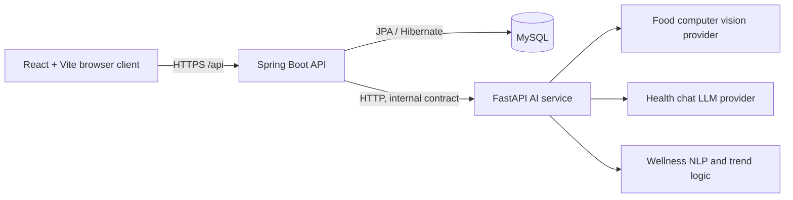

# System architecture

AI Health Companion uses a **modular monolith plus optional AI microservice** pattern. This keeps the BTech project straightforward to run while making AI providers replaceable and independently scalable.



## Responsibilities

| Layer | Responsibility | Must not do |
| --- | --- | --- |
| React | Pages, responsive UI, client validation, upload preview, charts, token attachment | Store secrets or make provider calls directly |
| Spring Boot | Auth, authorization, DTO validation, business rules, ownership checks, persistence and safe AI orchestration | Expose JPA entities or let one user read another user’s records |
| FastAPI | Provider adapters, model inference, provider-specific prompt/model handling | Authenticate users, own persistent user data or claim diagnosis |
| MySQL | User-owned records and audit-relevant timestamps | Store plaintext passwords or AI API keys |

## Request flows

### Food scan (Phase 4)

1. React validates image type and size, then sends a multipart image with the JWT.
2. Spring Security identifies the user; Spring validates MIME type, magic bytes and size.
3. `FoodScanService` sends the file to `FoodAnalysisService` through an AI client.
4. The selected provider returns only visible-condition evidence. Spring maps it to a DTO, adds the food-safety limitation and persists the user-owned scan.
5. React presents the analysis as guidance, never as a guarantee of safety.

### Health chat (Phase 5)

1. React posts a non-empty message to a user-owned conversation.
2. Spring checks conversation ownership, saves the user message and calls `HealthChatService`.
3. The service applies a safety policy: informational language, follow-up questions, red-flag escalation and no diagnosis/prescription.
4. Spring stores and returns the AI response, alongside the medical disclaimer.

### Wellness analysis (Phase 6)

1. React submits validated daily ratings and optional journal text.
2. Spring stores the entry and aggregates user-owned recent and previous-period data.
3. `WellnessAnalysisService` compares trends and may summarize non-clinical journal-language patterns.
4. The UI displays observations with a non-diagnostic support message.

## Provider replacement boundary

Controllers depend on application services; application services depend on provider-neutral contracts. Concrete mock, local-model or hosted-provider adapters live behind those contracts:

```text
Controller → Feature service → AI client → Provider-neutral contract → Mock / local model / hosted provider
```

`AI_MODE=mock` is explicit and visible in the client. Mock outputs will be labelled development samples; they will never be represented as model inference. `AI_MODE=production` will require a configured provider and must fail safely when unavailable.
