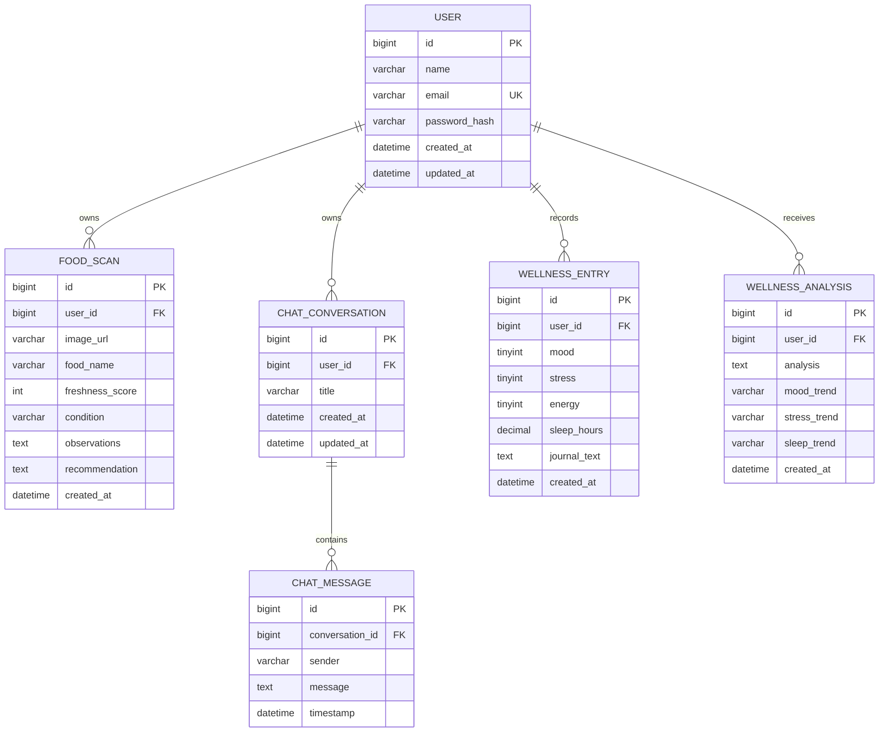

# Database design and ER diagram description

The schema will be introduced with JPA entities in Phases 2–6. All temporal values use UTC `Instant`/`TIMESTAMP`, and all feature records are user-owned.

## Integrity and privacy rules

- `user.email` has a unique, case-normalized index.
- All child foreign keys are non-null and indexed. Conversations cascade to their messages only when the owner deletes the conversation.
- User data queries always constrain by the authenticated `user_id`; an ID alone is never sufficient authorization.
- Passwords use BCrypt hashes. Uploaded images are stored outside the database or in managed object storage; only a safe reference is persisted.
- Wellness entries are self-reported measurements, not clinical records or diagnoses.
